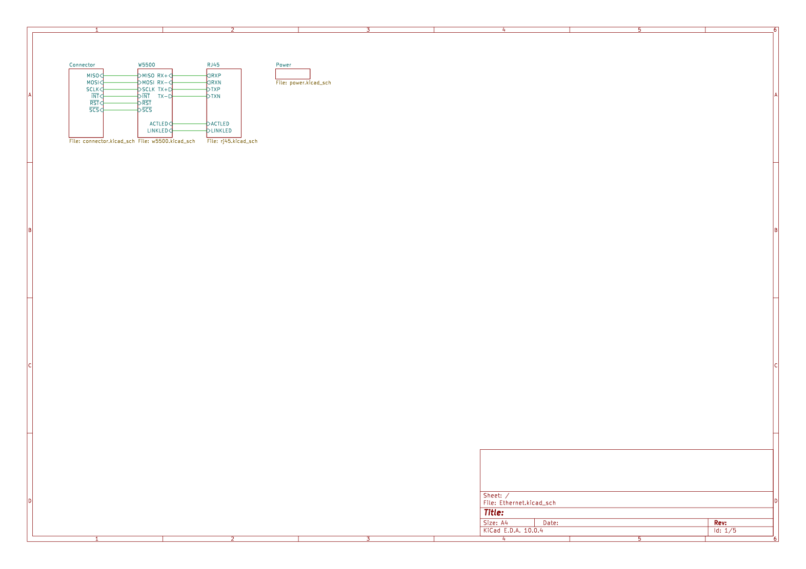
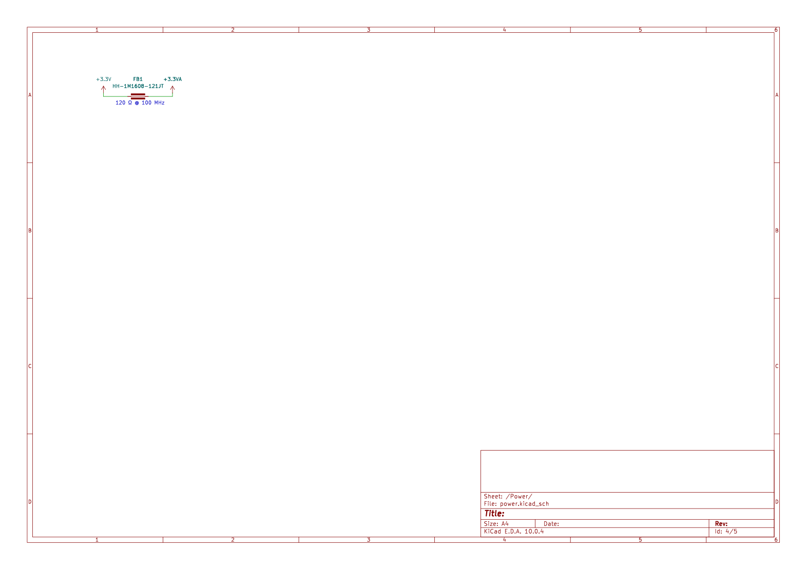
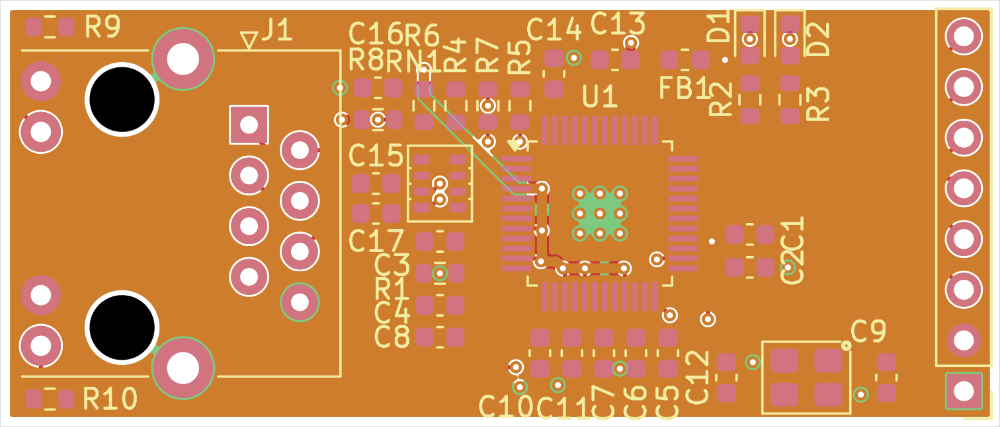
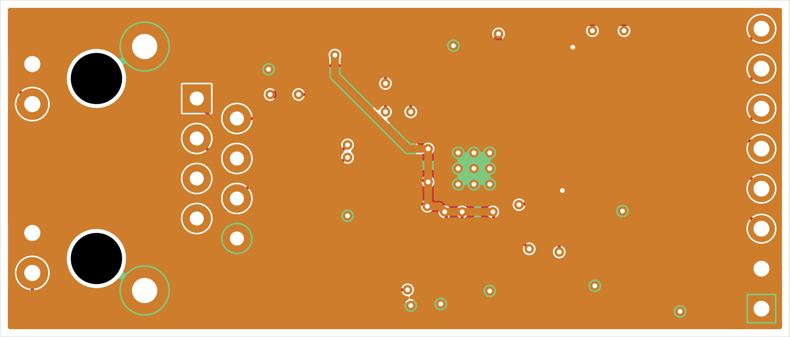
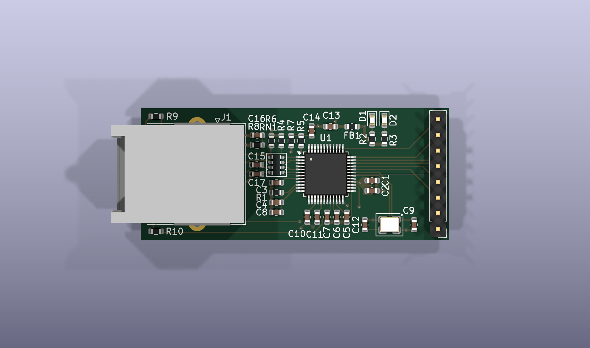
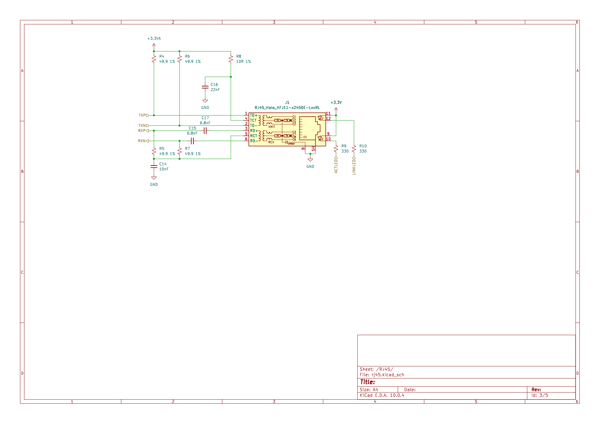

# September 18: Schematic capture

## What I did:

- Drew the whole schematic in one sitting, 4 sheets: root plus Power, RJ45, Connector, W5500
- Followed WIZnet's "RJ45 with Magnetics" reference design for the whole pair network rather than picking my own values
- 49.9R source termination on the transmit pair
- 6.8nF series caps isolating the receive pairs from the connected center tap
- 49.9R from the receive pairs to RCT, 10R bias on TCT, plus the center-tap caps
- 12.4k on EXRES1, 25MHz crystal with 18pF load caps, both straight from the datasheet
- One thing I changed on purpose: the ferrite bead. WIZnet's sheet uses `HH-1M1608-121JT` to split +3.3V from +3.3VA and I could not tell from the reference design alone whether that part number is a fuse or a bead. It is a bead. Annotated the sheet so I don't have to look it up again
- Split the hierarchy along functional boundaries rather than signal flow

## Why:

- The magjack side is the part where being confidently wrong is expensive. Bad termination shows up as intermittent link errors at 100mbit and not much else, which makes it miserable to debug
- A published layout a silicon vendor actually validated beats my own intuition, and it means I can say where every value came from
- Functional sheets because I kept coming back to the power split and the pair network from different places, and separate sheets stopped me losing track of which 3.3V rail a part was on

## Screenshots:

**Total time spent: 4 hours**

# September 20: Layout and routing

## What I did:

- 50.0 x 21.4mm, routed all 201 track segments by hand, no autorouter
- Went to 4 layers instead of the reference design's 2. Solid GND on In1.Cu, solid +3.3V on In2.Cu
- Routed all 4 pairs J1 -> RN1 -> U1 as short parallel traces on F.Cu with continuous ground directly underneath
- 41 through vias, 0.6mm pad / 0.3mm drill, no blind or microvias
- One netclass the whole way, 0.1mm clearance and 0.2mm track
- The bead worked out by accident: U1 sits mid-board so the analog rail reaches AVDD without the SPI traffic crossing it

## Why:

- 2 layers would have been cheaper and I would have fought it for a week. A ground plane directly under the pairs is most of what a 100MHz-class diff pair needs on 1.6mm
- 4 layers at this size from JLCPCB was still inside budget
- No autorouter because Ethernet pairs are the one place I want to know exactly what happened
- Skipped a tighter netclass for the pairs: at these lengths there is no room for it to buy anything, and a netclass I never leaned on is just a thing to misread later

## Screenshots:

**Total time spent: 7 hours**

# September 22: 3D model that does not exist

## What I did:

- Spent most of this entry failing to find the connector model
- The KiCad footprint for the Halo FastJack points at `RJ45_HALO_HFJ11-x2450E-LxxRL_Horizontal.step`. Not in the KiCad 3D model library. Not in upstream kicad-packages3D either, there are exactly 3 RJ45 models there and none are Halo's. The footprint has been pointing at a model that was never published
- Until this session the board pointed at a completely different connector, a Molex 9346520x
- Tried the places you are supposed to try. Halo's site has no CAD, only PDFs. 3Dfindit gave me a Cloudflare 403. Ultra Librarian says "No 3D Model Available". SnapMagic says "Preview not available". 3DContentCentral has variants but behind a login and the wrong variant. About 2 hours of that entry, nothing
- So I built one. `kicad/3dparts/build_halo_hfj11_model.py` generates the connector from the mechanical drawing
- The catch: the drawing's dimension callouts are not text, they are vector outlines, so I had to scale-calibrate the geometry against a known value. Anchored on the 0.625 in width, the model's 15.88mm matched KiCad's fab outline exactly and the 0.850 in depth matched the 21.59mm fab depth exactly. Two confirmations from a source I did not control
- Result is STEP AP214 at 16.66 x 21.59 x 13.30mm with a VRML fallback, plus a board STEP export in `kicad/production/`

## Why:

- Needed it for two things: checking the connector actually fits the board outline, and the assembled render for the README. Both need geometry, neither needs vendor accuracy
- Called it a reconstruction in the README because the port cavity is the weak part. Halo does not dimension it so I proportioned 11.6 x 10.36mm off a different manufacturer's magjack. Better to write down which numbers are solid and which are a guess than let someone find the guess by plugging a virtual plug in

## Screenshots:

**Total time spent: 5 hours**

# September 24: Connector is in the wrong place

## What I did:

- Reading the drawing to build the model turned up something I had missed. Halo wants the mating face 0.429 in, 10.90mm, outboard of the PCB edge. Mine is 4.795mm outboard
- That leaves 6.1mm of 1.6mm board standing in the plug's path that should not be there
- Went back and forth on the orientation for a while, because reading it the other way round produces a nonsense answer: if the mouth faced inward the connector would be mounted backwards
- Settled it with four checks that all agree. LED pins sit at 60% of body depth toward the front and LED windows belong at the front of a magjack. Silkscreen outline stops 5.9mm short of one end, which is the port opening. Pin row is 17.25mm behind the face, normal RJ45 contact depth. And 4.8mm of overhang past a board edge is what a horizontal magjack looks like when it is right
- The 0.429 in callout was the one I trusted most. 17.250 - 10.90 = 6.350, and that is exactly where the footprint puts its 3.25mm locating pegs. The datasheet and the footprint library agreeing to three decimals on a number neither one was derived from
- Fix is either trimming the left edge to X = 36.1mm or moving J1 6.105mm toward -X. Have not done it yet

## Why:

- Caught this only because I built the 3D model. Otherwise I would have looked at the board, seen the connector near the edge, and shipped it
- It will still work. A bare plug seats, the contacts are 17mm back and there is room for that. But the overmold can hit that edge, and in a case it is a wall right where you are trying to plug something in
- Leaving it as a written known issue instead of quietly fixing it, because the number is specific and somebody should check my arithmetic

## Screenshots:

**Total time spent: 2 hours**

# September 25: BOM, docs, production output

## What I did:

- Sourced all 19 BOM lines. Everything is LCSC except the RJ45 magjack, which has to come from DigiKey because every HFJ11 variant shows zero stock at JLCPCB
- That one part is 61.6% of the bill
- Wrote the README and this journal, exported gerbers and drill files and the board STEP, rendered the images
- Added a `.gitignore` for the KiCad autosave history. It needed the pattern without a trailing slash, because `.history` is its own embedded git repo and with the slash git records a gitlink and `git add` fails
- Also ignored a stray duplicate `.kicad_pro` that had ended up at the repo root, identical to the real one in `kicad/`
- Repointed J1 at the new model, then re-ran DRC. Still 2 `lib_footprint_mismatch` warnings, so I diffed both footprints against their library copies line by line. Every pad, drill, silk, fab and courtyard line matches. The differences are metadata and the model path, and the model path difference is the fix I just made
- Fact-checked the README against the board file and found real errors in my own first draft: claimed the pairs were length-matched (they are not, TX skew is 5.31mm between J1 and RN1), said D1/D2 came off LINKLED/ACTLED (they come off SPDLED/DUPLED), called the W5500 register SCR when it is SMR, and claimed B.Cu carried the SPI and pair routing when 167 of 201 segments are on F.Cu

## Why:

- Expected a $2 board, got an $8.50 board, almost entirely because a magjack with a proper isolation transformer costs what one costs. The interesting engineering is not in the cheap parts
- The DRC warnings nearly did not make it into the README. Writing "DRC clean, 0 violations" when the tool says otherwise falls apart the moment someone runs the tool themselves, so they got written up with the diff that explains them
- Caught the length-match claim only because I measured the segments instead of trusting the earlier draft. Everything in the README is measured off the board file now

## Screenshots:

**Total time spent: 4 hours**
