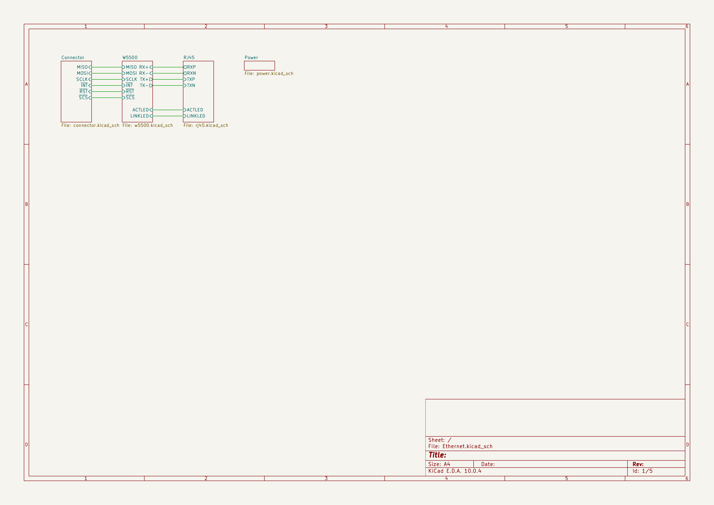
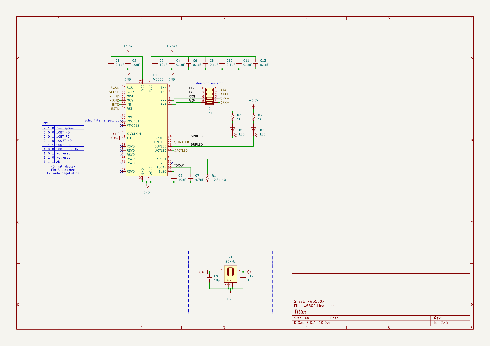
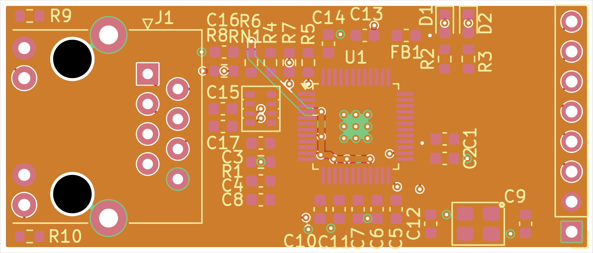
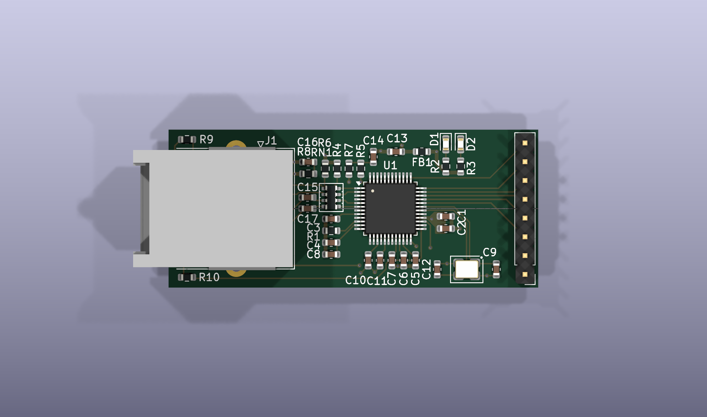
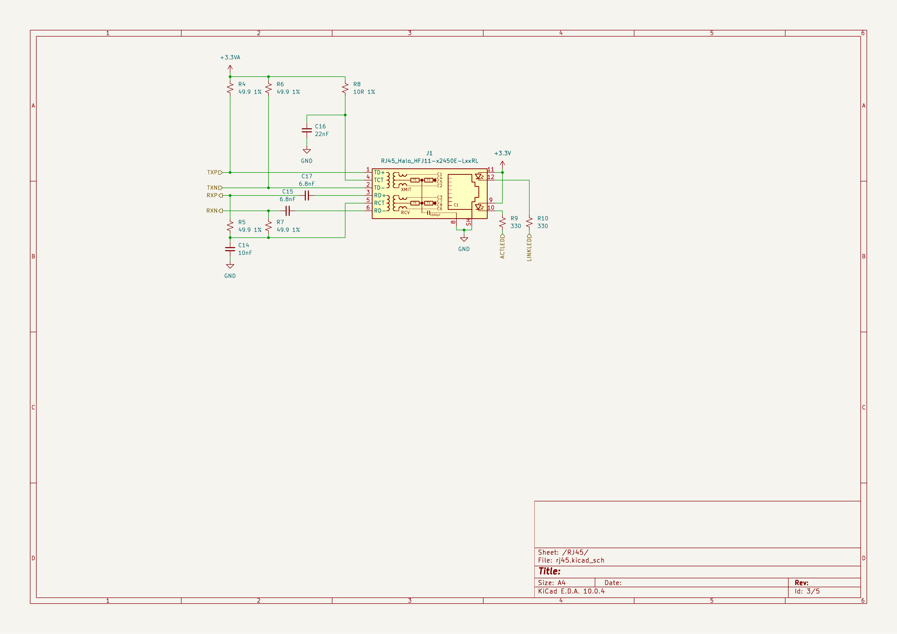

# September 18: Schematic

## What I did:
- Drew the schematic
- Followed WIZnet's reference design
- Used 12.4k for EXRES1, 25MHz crystal with 18pF load caps
- Split into functional sheets

## Why:
- Wanted a safe reference for the magjack side
- Easier to keep track of power and signals

## Screenshots:

**Total time spent: 4 hours**

# September 20: Layout

## What I did:
- 50.0 x 21.4mm, 4 layers (GND on In1.Cu, 3.3V on In2.Cu)
- Routed Ethernet pairs on top with ground underneath
- Kept traces short and parallel

## Why:
- Easier to get clean routing than 2-layer for this board
- Wanted to know exactly what I routed

## Screenshots:

**Total time spent: 7 hours**

# September 22: 3D model

## What I did:
- Built a STEP model for the Halo HFJ11 since none existed
- Calibrated from the mechanical drawing
- Generated VRML fallback

## Why:
- Needed for assembly check and README render
- Had to be explicit about guesses

## Screenshots:

**Total time spent: 5 hours**

# September 24: Connector position fix

## What I did:
- Realized the mating face needs to be ~10.9mm from board edge
- Currently ~4.8mm - needs moving
- Documented the issue

## Why:
- Caught it while making the model
- Better to note it than ignore it

## Screenshots:

**Total time spent: 2 hours**

# September 25: BOM, docs, production

## What I did:
- Sourced parts (magjack from DigiKey, rest mostly LCSC)
- Wrote README and journal
- Exported gerbers, drill, STEP
- Fixed .gitignore and cleaned up
- Rechecked DRC and fixed errors in README

## Why:
- Magjack drives most of the cost
- Wanted accurate docs

## Screenshots:

**Total time spent: 4 hours**
