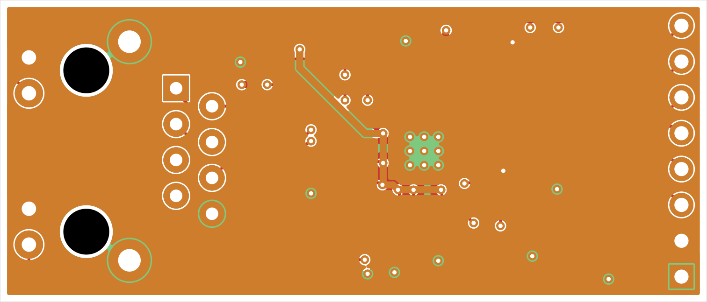
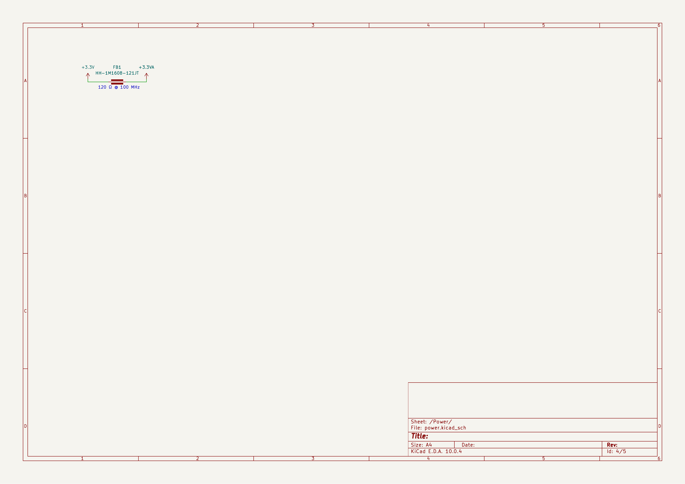
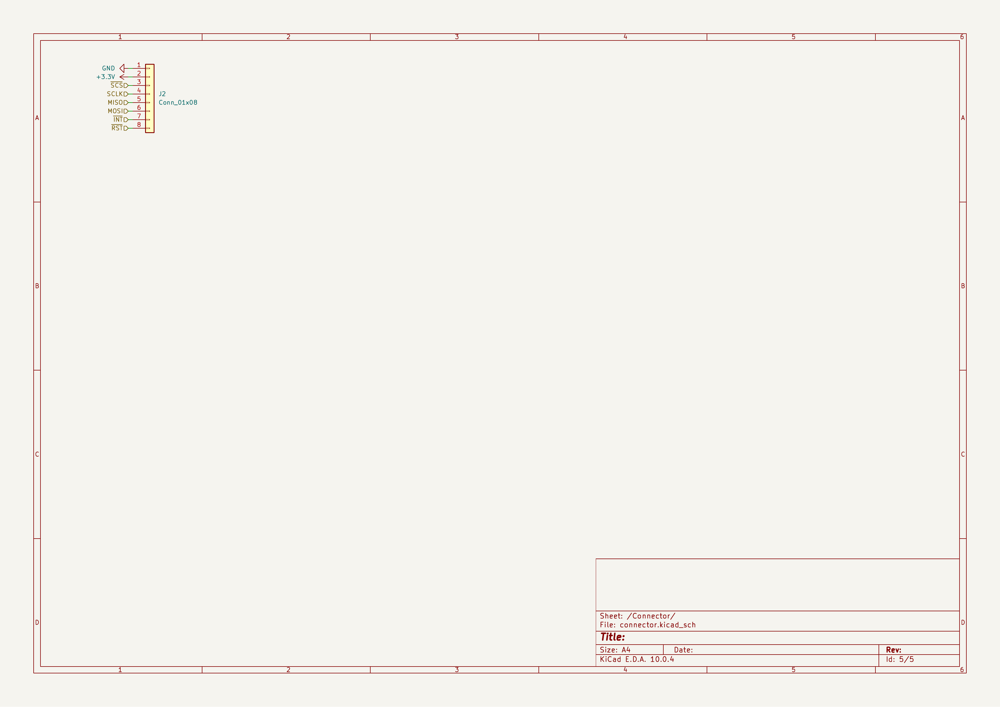

# W5500 Ethernet Module

A small SPI Ethernet breakout for the W5500.

## Features

- SPI interface
- 10/100 Ethernet
- 4-layer board with ground and 3.3V planes
- Split analog/digital supply with ferrite bead
- On-board and jack LEDs
- 25 MHz crystal

## PCB

50.0 x 21.4 mm, 4-layer, 1.6 mm FR-4.

## Schematic

## Pinout

| Pin | Name | Notes |
|---|---|---|
| 1 | GND | Ground |
| 2 | 3.3V | Power in |
| 3 | SCS | Chip select (active low) |
| 4 | SCLK | SPI clock |
| 5 | MISO | SPI MISO |
| 6 | MOSI | SPI MOSI |
| 7 | INT | Interrupt (active low) |
| 8 | RST | Reset (active low) |

## BOM

| Ref | Value | MPN | Manufacturer | Qty | Unit $ | Ext $ | Supplier Link |
|-----|-------|-----|--------------|-----|--------|-------|---------------|
| C1,C4,C6,C8,C10,C11,C13 | 0.1uF 50V X7R 0603 | CL10B104KB8NNNC | Samsung Electro-Mechanics | 7 | 0.0088 | 0.0616 | [LCSC](https://www.lcsc.com/product-detail/Samsung-Electro-Mechanics-CL10B104KB8NNNC_C1591.html) |
| C9,C12 | 18pF 50V C0G 0603 | 0603N180J500CT | Union Semiconductor | 2 | 0.0069 | 0.0138 | [LCSC](https://www.lcsc.com/product-detail/Union-Semiconductor-0603N180J500CT_C123538.html) |
| C5,C14 | 10nF 50V X7R 0603 | CL10B103KB8NNNC | Samsung Electro-Mechanics | 2 | 0.0103 | 0.0206 | [LCSC](https://www.lcsc.com/product-detail/Samsung-Electro-Mechanics-CL10B103KB8NNNC_C1589.html) |
| C15,C17 | 6.8nF 50V X7R 0603 | CL10B682JB8NNNC | Samsung Electro-Mechanics | 2 | 0.0075 | 0.0150 | [LCSC](https://www.lcsc.com/product-detail/Samsung-Electro-Mechanics-CL10B682JB8NNNC_C307492.html) |
| C16 | 22nF 50V X7R 0603 | CC0603KRX7R9BB223 | Yageo | 1 | 0.0063 | 0.0063 | [LCSC](https://www.lcsc.com/product-detail/YAGEO-CC0603KRX7R9BB223_C106222.html) |
| C2,C3 | 10uF 10V X5R 0603 | CL10A106KP8NNNC | Samsung Electro-Mechanics | 2 | 0.0322 | 0.0644 | [LCSC](https://www.lcsc.com/product-detail/Samsung-Electro-Mechanics-CL10A106KP8NNNC_C19702.html) |
| C7 | 4.7uF 10V X5R 0603 | CL10A475KP8NNNC | Samsung Electro-Mechanics | 1 | 0.0164 | 0.0164 | [LCSC](https://www.lcsc.com/product-detail/Samsung-Electro-Mechanics-CL10A475KP8NNNC_C1705.html) |
| D1,D2 | LED red high-efficiency 0603 | KT-0603R | Keystone Electronics | 2 | 0.0076 | 0.0152 | [LCSC](https://www.lcsc.com/product-detail/Keystone-Electronics-KT-0603R_C2286.html) |
| FB1 | Ferrite bead 120R 0603 | CBW160808U121T | Sunlord | 1 | 0.0086 | 0.0086 | [LCSC](https://www.lcsc.com/product-detail/Sunlord-CBW160808U121T_C139175.html) |
| J1 | RJ45 magjack HFJ11-2450E-L11RL | HFJ11-2450E-L11RL | Halo Electronics | 1 | 5.2300 | 5.2300 | [DigiKey](https://www.digikey.com/en/products/detail/halo-electronics-inc/HFJ11-2450E-L11RL/25658121) |
| J2 | Header 1x08 2.54mm | 2.54-1*8 | CONNFLY Elec | 1 | 0.0442 | 0.0442 | [LCSC](https://www.lcsc.com/product-detail/CONNFLY-Elec-2-54-1-8_C5156616.html) |
| R1 | 12.4k 1% 0603 | 0603WAF1242T5E | UniRoyal Elec | 1 | 0.0015 | 0.0015 | [LCSC](https://www.lcsc.com/product-detail/UNI-ROYAL-Uniroyal-Elec-0603WAF1242T5E_C22865.html) |
| R2,R3 | 1k 1% 0603 | 0603WAF1001T5E | UniRoyal Elec | 2 | 0.0026 | 0.0052 | [LCSC](https://www.lcsc.com/product-detail/UNI-ROYAL-Uniroyal-Elec-0603WAF1001T5E_C21190.html) |
| R4,R5,R6,R7 | 49.9R 1% 0603 | RC0603FR-0749R9L | Yageo | 4 | 0.0062 | 0.0248 | [LCSC](https://www.lcsc.com/product-detail/YAGEO-RC0603FR-0749R9L_C114625.html) |
| R8 | 10R 1% 0603 | 0603WAF100JT5E | UniRoyal Elec | 1 | 0.0032 | 0.0032 | [LCSC](https://www.lcsc.com/product-detail/UNI-ROYAL-Uniroyal-Elec-0603WAF100JT5E_C22859.html) |
| R9,R10 | 330R 1% 0603 | 0603WAF3300T5E | UniRoyal Elec | 2 | 0.0026 | 0.0052 | [LCSC](https://www.lcsc.com/product-detail/UNI-ROYAL-Uniroyal-Elec-0603WAF3300T5E_C23138.html) |
| RN1 | 0R array 0603x4 | 4D03WGJ0000T5E | UniRoyal Elec | 1 | 0.0090 | 0.0090 | [LCSC](https://www.lcsc.com/product-detail/UNI-ROYAL-Uniroyal-Elec-4D03WGJ0000T5E_C1952.html) |
| U1 | W5500 LQFP-48 | W5500 | WIZnet | 1 | 2.8503 | 2.8503 | [LCSC](https://www.lcsc.com/product-detail/WIZnet-W5500_C32843.html) |
| X1 | 25MHz 3225 | TXC-7A-25.000MBB-T | TXC Corporation | 1 | 0.0954 | 0.0954 | [LCSC](https://www.lcsc.com/product-detail/TXC-Corp-TXC-7A-25-000MBB-T_C9006.html) |
| PCB | 50.0x21.4mm 4-layer FR-4 (5 pcs, est.) | - | JLCPCB | 5 | 2.0000 | 10.0000 | [JLCPCB](https://jlcpcb.com/) |
| **Total (parts per 1 board)** | | | | | | **8.49** | |
| **Grand total (5 boards: parts + PCBs)** | | | | | | **52.45** | |

Full BOM: [BOM.csv](BOM.csv)

## Production

Gerbers, drill files, STEP, IPC netlists, and placement files are in `kicad/production/`.

## Known issues

- The RJ45 mating face is ~6.1 mm closer to the board center than Halo recommends. Check case clearances.
- No mounting holes.

## License

Hardware: CERN-OHL-S-2.0. This covers the board design and the reconstructed 3D model for the magjack.

Based on WIZnet's W5500 reference design.
